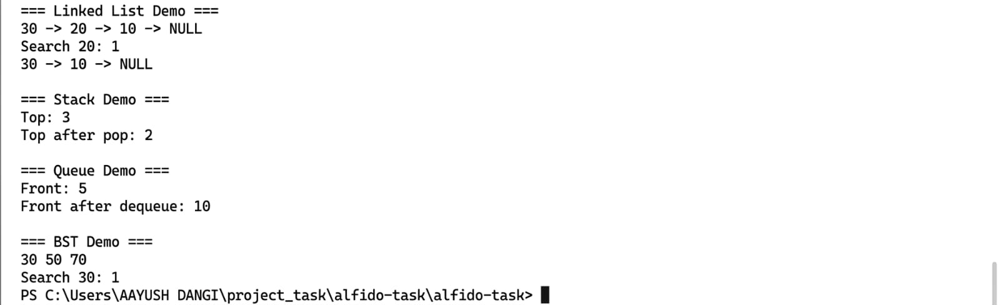

# alfido-task
# Data Structures Implementation (C++)

## Goal
Implement core data structures from scratch: Linked List, Stack, Queue, and Binary Search Tree.

## Requirements
- Implemented insert, delete, search operations
- Driver program demonstrates functionality
- Complexity analysis included in comments

## Deliverables
1. Source code in multiple `.cpp` and `.h` files
2. Sample input/output via `main.cpp`
3. README with explanation

## Sample Output

## Complexity Analysis
- Linked List: Insert/Delete/Search -> O(n)
- Stack: Push/Pop/Top -> O(1)
- Queue: Enqueue/Dequeue/Front -> O(1)
- BST: Insert/Search -> O(log n) average, O(n) worst-case

Author - Aayush dangi
